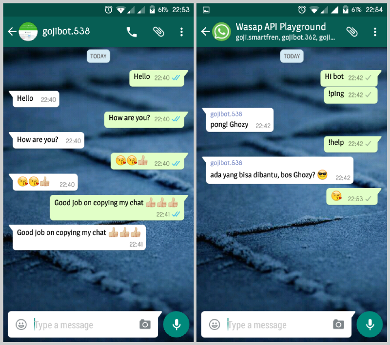

# wasapbot

Read in [English](README.md).

Script bot WhatsApp yang sangat sederhana, menggunakan library [Chat-API](https://github.com/WHAnonymous/Chat-API). Sebagai contoh, script wasapbot ini akan mengirim kembali chat yang dikirimkan melalui pesan privat, dan akan menanggapi kiriman "!ping" atau "!help" di grup.

Tentu saja Anda bisa menambahkan fitur dan fungsi lain untuk bot ini, karena scriptnya sangat sederhana. Silakan dioprek sesuai keperluan :smile:



---

> Di sini akan dicontohkan untuk setup di Linux Ubuntu, untuk setup di sistem lain serta semua hal lain yang belum dijelaskan di readme ini, silakan mengacu ke repository [Chat-API](https://github.com/WHAnonymous/Chat-API).

---

### 1. Persiapan & Setup

#### Install dependency yang dibutuhkan Chat-API ([acuan](https://github.com/WHAnonymous/Chat-API/wiki/Dependencies))
Install dependency dengan command:  
  
  ```
   $ sudo apt-get update
   $ sudo apt-get install ffmpeg openssl php5-cli php5-gd php5-curl php5-sqlite php5-mcrypt
  ```

Pastikan dependency sudah terpasang. Beberapa hal yang perlu diperiksa sebelum memulai wasapbot:

- Periksa versi php:  
` $ php -v `  
pastikan versinya >= 5.6
```
 PHP 5.6.16-2+deb.sury.org~trusty+1 (cli) 
 Copyright (c) 1997-2015 The PHP Group
 ......
```

- Periksa ekstensi *mcrypt* sudah ter-*load*  
` $ php -i | grep ^mcrypt `  
pastikan ada output seperti berikut:
```
 mcrypt
 mcrypt support => enabled
 mcrypt_filter support => enabled
 mcrypt.algorithms_dir => no value => no value
 mcrypt.modes_dir => no value => no value
```

Jika tidak ada masalah, Anda bisa melanjutkan ke langkah berikutnya.  

#### Mendapatkan token/password WhatsApp untuk nomor Anda

Ada beberapa tool untuk mendapatkan password WhatsApp, diantaranya adalah:

- Menggunakan script CLI [registerTool.php](https://github.com/mgp25/WhatsAPI-Official/blob/master/examples/registerTool.php) dari Chat-API
- Menggunakan [WART](https://github.com/mgp25/WART) (untuk Windows)
- Menggunakan online tool http://watools.es/pwd.html

Sebagai contoh, kita akan menggunakan registerTool.php (Anda tetap bisa menggunakan tool lain, silakan merujuk ke repository [Chat-API](https://github.com/WHAnonymous/Chat-API)).

1. Siapkan nomor yang akan dijadikan nomor bot, disarankan untuk menggunakan nomor yang belum pernah menggunakan WhatsApp sebelumnya, pastikan nomor tersebut bisa menerima sms atau menerima panggilan (untuk menerima kode WhatsApp)
2. Download repository ini, lalu ekstrak.
3. Masuk ke folder [whatsapp/examples/](whatsapp/examples/) dan jalankan registerTool.php:  
` $ cd whatsapp/examples/ `
` $ php registerTool.php `
4. Masukkan nomor bot (awali dengan kode negara, tanpa tanda plus '+'):  
misal: ` 6285xxxxxxxxx `
5. Akan ada pilihan method 'sms' atau 'voice', pilih salah satu
6. Tunggu kiriman kode dari WhatsApp
7. Inputkan kode dalam format ` XXX-XXX `
8. Password didapatkan!  
biasanya dengan format: ` gojigejeB79ONvyUV87TtBIP8v7= `

Jika terjadi error atau fail, silakan merujuk ke repository [Chat-API Issues](https://github.com/WHAnonymous/Chat-API/issues) untuk mengetahui penyebabnya dan cara mengatasinya. Yang perlu diperhatikan adalah bagian  ` [reason] ` dan ` [retry_after] `. ` [reason] ` adalah alasan mengapa terjadi kegagalan, dan  ` [retry_after] ` adalah waktu jeda/tunggu yang harus diikuti sebelum mencoba melakukan register ulang dalam satuan detik (3600 = 1 jam).

**PENTING!** Sebaiknya tidak mencoba melakukan register ulang dalam waktu jeda ini, karena bisa mengakibatkan nomor Anda diblok oleh WhatsApp (` [reason] => blocked `) dan tidak bisa digunakan untuk WhatsApp (baik melalui API ataupun melalui aplikasi resmi!) :sob:.

*TIPS*: Anda bisa mencoba method pengiriman kode lain jika method sebelumnya gagal. Misalnya gagal ketika menggunakan method 'sms', Anda bisa mencoba menggunakan method 'voice', namun tetap perhatikan bagian ` [retry_after] `.

### 2. Menjalankan Bot

Jika password sudah didapatkan, maka selanjutnya tinggal menjalankan script [wasapbot.php](wasapbot.php).

1. Ubah variabel ` $username `, ` $password `, dan ` $nickname ` sesuai dengan bot Anda.
2. Jalankan via CLI:  
` $ php wasapbot.php `  
tunggu hingga muncul tulisan 'BOT SIAP'.
3. Coba kirim pesan ke bot, jika pesan dikirim kembali, maka bot sudah berhasil dijalankan.

#### Troubleshooting / Ketika Gagal Menjalankan Bot

- Coba beri komentar baris ` error_reporting(....) ` (*baris 19*) agar php menampilkan pesan error, lalu analisa outputnya.
- Coba ubah variabel ` $debug ` menjadi *true* agar Chat-API mengaktifkan mode debug, lalu analisa outputnya.

### 3. Mengubah Perilaku / Balasan Bot

Pada project ini hanya dicontohkan perilaku bot untuk merespon *event* pesan privat dan *event* pesan grup dengan ` if else ` sederhana. Anda bisa mengubahnya dengan cara mengedit function ` onGetMessage(...) ` dan ` onGetGroupMessage(...) ` (*baris 126 dan baris 182*).

Anda bisa menambahkan *event* lain untuk menambah fitur bot, silakan merujuk ke [Chat-API Events](https://github.com/WHAnonymous/Chat-API/wiki/WhatsAPI-Documentation#list-of-all-events) untuk daftar event yang tersedia.

Semoga bermanfaat :)

### Berkontribusi

Project ini hanya sekedar contoh sederhana dan masih sangat minimal dalam menggunakan API-API yang ada pada Chat-API. Silakan berkontribusi dalam bentuk apapun agar membantu project ini menjadi lebih baik.

* *Fork* dan ajukan *Pull Request*
* Laporkan *bug* dan berikan saran di form [Issues](issues)
* Kontak saya via telegram: http://telegram.me/gojigeje
